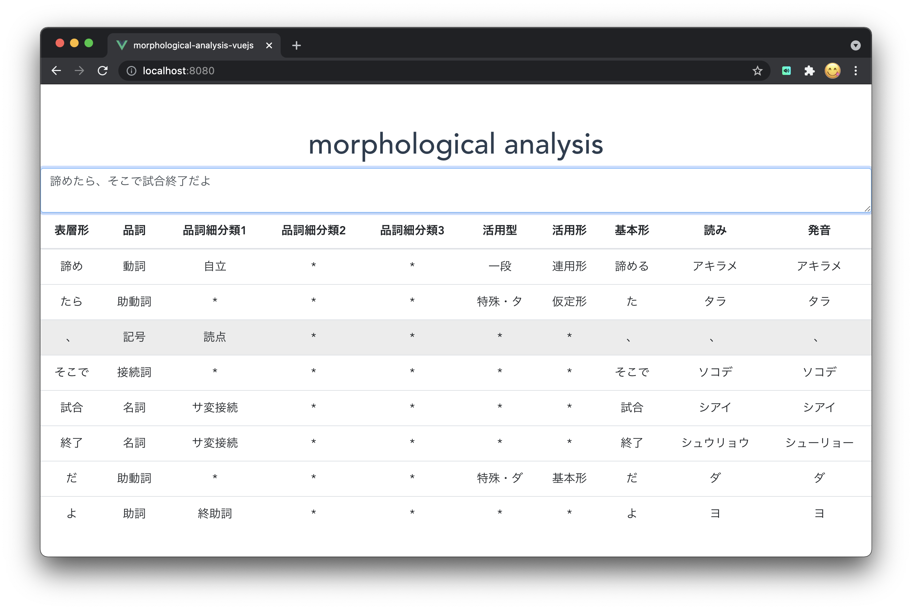

<h1 align="center">
   
  
   
  morphological analysis
   
</h1>
<h4 align="center">
   In this sample, we are using Kuromoji.js to perform morphological analysis.
   This sample is running on top of vue.js.
   It analyzes Japanese input in the text area in real time.
   
   
</h4>

# live demo
https://tatsunori-iwaki.github.io/kuromoji-morphological-analysis/

# screen shots

